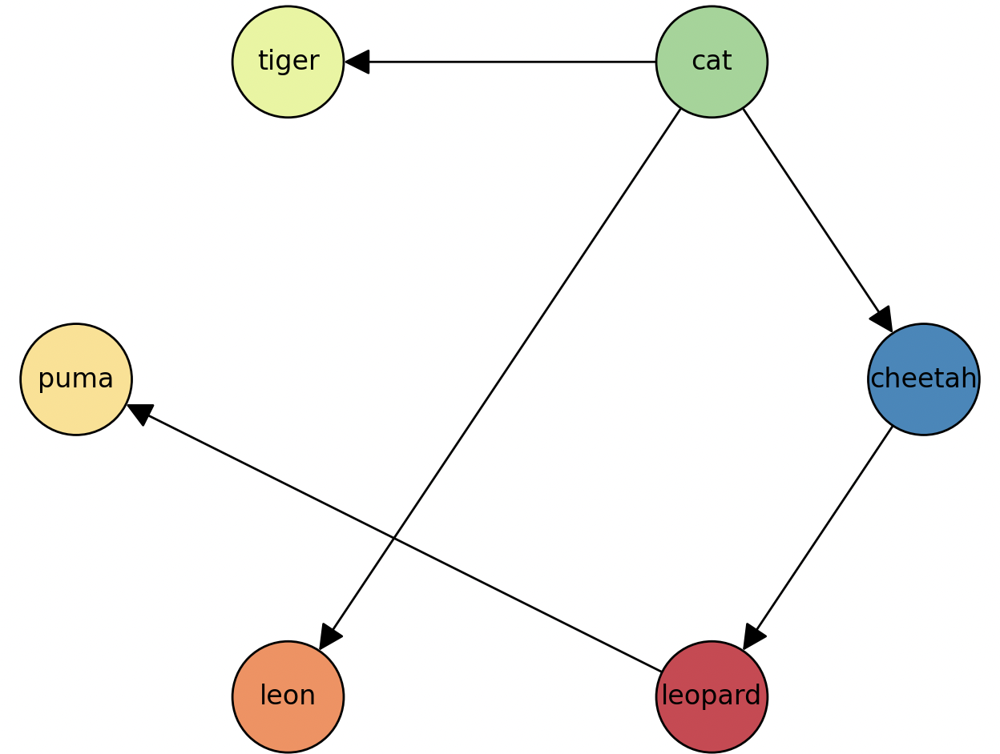

# Build images according to hierarchy

This repository builds a chain of images that depend on each other.

# Contents

-   [Dependency graph](#dependency-graph)
-   [Dependency hierarchy](#dependency-hierarchy)
-   [Usage](#usage)
    -   [Drawing Graph](#drawing-graph)
    -   [Initial build](#initial-build-hierarchy-creation)
    -   [Local usage](#локальное-использование)
-   [Adding a new image](#adding-a-new-image)
-   [Versioning](#versioning)
-   [Pipeline](#pipeline)

### Dependency graph


    
    ╙── cat
        ├─╼ tiger
        ├─╼ leon
        └─╼ cheetah
            └─╼ leopard
                └─╼ puma

### Dependency hierarchy

Dependencies are defined in `tree.txt` and are inherited **left to right**.

```
cat
cat tiger
cat leon
cat cheetah
cat cheetah leopard
cat cheetah leopard puma
```

### Usage

```bash
python3 -m hierarchy_builder.run --help
Usage: python -m hierarchy_builder.run [OPTIONS] COMMAND [ARGS]...

  Application command line interface

Options:
  --help  Show this message and exit.

Commands:
  build-hierarchy  Build images according to the hierarchy
  show-hierarchy   Visualize the image hierarchy
```

```bash
python3 -m hierarchy_builder.run build-hierarchy --help
Usage: python -m hierarchy_builder.run build-hierarchy [OPTIONS]

  Build images according to the hierarchy

Options:
  --tree-file TEXT     Path to file with hierarchy  [required]
  --git-diff TEXT      Git diff after merge (newline-separated)  [required]
  --push TEXT          Push image(s) after build
  --disable-deps TEXT  Disable building of dependencies
  --bump-type TEXT     Type of version bump (major, minor, patch)
  --dry-run TEXT       Enable dry run mode
  --help               Show this message and exit.
```

```bash
python3 -m hierarchy_builder.run show-hierarchy --help
Usage: python -m hierarchy_builder.run show-hierarchy [OPTIONS]

  Visualize the images hierarchy

Options:
  --tree-file TEXT  Path to file with hierarchy  [required]
  --help            Show this message and exit.
```

#### Arguments

| Command         | Argument       |  Type   |                                  Decription |
| --------------- | -------------- | :-----: | ------------------------------------------: |
|                 | --tree-file    | string  |                          path to `tree.txt` |
|                 | --git-diff     | string  | Git diff after `merge`\* new line separated |
| build-hierarchy | --push         | boolean |                    `push image` after build |
|                 | --disable-deps | boolean |       Build/Push for one image without deps |
|                 | --bump-type    | string  |              patch/minor/major bump version |
| build-hierarchy | --tree-file    | string  |                          path to `tree.txt` |

> **NOTE:** `--git-diff` changes the `Dockerfile` of all images. For local execution, use any image name from the hierarchy.

#### Variables in `config.py`

| Variable        |  Type  |                                Description |
| --------------- | :----: | -----------------------------------------: |
| log_level       | string |                           logger log level |
| dockerfile      | string |                            dockerfile name |
| docker_registry | string |                            docker repo url |
| base_image      | string | base image name from what root image build |
| base_image_tag  | string |  base image tag from what root image build |
| share_args      |  dict  |                 share args for image build |
| exclude_images  |  list  |  images for exclude during hierarchy build |
| images          |  dict  |  specific vars for each image in hierarchy |

### Local usage

#### Environment setup:

```bash
python3 -m venv ./venv
source venv/bin/activate
pip3 install -r /path/to/requirements.txt
```

#### Drawing Graph

```bash
python3 -m hierarchy_builder.run show-hierarchy --tree-file hierarchy_builder/tree.txt
```

#### Initial build (hierarchy creation)

> **NOTE:** `Need to execute in first time for building full hierarchy`

```bash
python3 -m hierarchy_builder.run build-hierarchy --tree-file hierarchy_builder/tree.txt --git-diff cat --push true
```

#### Building Images locally

```bash
# dry-run mode
python3 -m hierarchy_builder.run build-hierarchy --tree-file hierarchy_builder/tree.txt --git-diff cat --dry-run true

# new image without deps with push to docker registry
python3 -m hierarchy_builder.run build-hierarchy --tree-file hierarchy_builder/tree.txt --git-diff cat --push true --disable-deps true

# new image with deps without push to docker registry
python3 -m hierarchy_builder.run build-hierarchy --tree-file hierarchy_builder/tree.txt --git-diff cat

# new image for cheetah without deps with push to docker registry
python3 -m hierarchy_builder.run build-hierarchy --tree-file hierarchy_builder/tree.txt --git-diff cheetah --push true --disable-deps true

# new image for cheetah wit deps without push to docker registry
python3 -m hierarchy_builder.run build-hierarchy --tree-file hierarchy_builder/tree.txt --git-diff cheetah --push true
```

### Adding a New Image

#### New image

-   Create directory for new image
-   Add `Dockerfile` to directory
-   Add to hierarchy (image name should be the same as directory name)
    -   add image to `tree.txt`
        ```txt
        cat
        cat tiger
        cat leon
        cat cheetah
        cat cheetah leopard
        cat cheetah leopard puma <new_image>
        ```
-   Add nessesary value into `images` in the `config.py`, according to example

```python
...
images = {
    "cat": {
        "name": cat,
        "args": share_args
    },
    # "new_image": {
    #     "name": "name",
    #     "args": share_args | {"NEW_ARG_KEY": "new_arg_value"}
    # }
}
```

### Versioning

Semantic Versioning (Semver) is used for versioning.

After the **initial build**, if you set `--bump-type` to `patch`, all images will be tagged with version `0.0.1`.

For example, if the Dockerfile for cheetah is modified, the dependency hierarchy ensures that leopard and puma will also be rebuilt after cheetah:

1. `cheetah:0.0.2` will be rebuilt, inheriting from its parent `cat:0.0.1`.

2. `leopard:0.0.2` will be rebuilt, inheriting from its updated parent `cheetah:0.0.2`.

3. `puma:0.0.2` will be rebuilt, inheriting from its updated parent `leopard:0.0.2`.

### Pipeline
It is supposed to build images via `git diff` using any ci tool (github, gitlab, teamcity etc.)

For example: 
```bash
git_diff=$(git diff --name-only  | grep -i dockerfile | cut -f1 -d '/')

python3 -m hierarchy_builder.run build-hierarchy \
    --tree-file hierarchy_builder/tree.txt \
    --git-diff ${git_diff} \
    --push true \
    --bump-type patch
```
